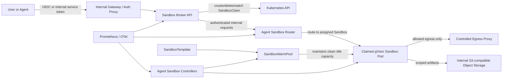

# Agent Sandbox Platform Specification

**Status:** Proposed implementation specification  
**Target:** Self-hosted, on-premises Kubernetes  
**Primary use case:** Multi-user execution of untrusted or semi-trusted agent-generated code  
**Baseline upstream:** Kubernetes SIG Agent Sandbox `v0.5.3`, APIs `v1beta1`  
**Primary runtime isolation:** gVisor through Kubernetes `RuntimeClass`  
**Design decision:** One sandbox per active session, not one sandbox per registered user

---

## 1. Executive decision

Build a small Kubernetes-native sandbox platform around the following components:

1. Kubernetes SIG Agent Sandbox controller and extension CRDs.
2. A `SandboxWarmPool` with a small number of clean, prestarted sandboxes.
3. A `SandboxClaim` for each active agent session.
4. gVisor on dedicated sandbox worker nodes.
5. A small internal **sandbox broker** that owns authentication, authorization, quotas, claim lifecycle, and routing.
6. A single shared Agent Sandbox Router, reachable only from the broker.
7. Ephemeral local workspaces by default, with durable artifacts written to an internal S3-compatible object store.

Do **not** allocate a permanent pod per user. A user only consumes a sandbox while a session is active. When the session ends, the claimed sandbox is destroyed and the warm pool creates a clean replacement.

The first production target is:

| Setting | Initial value |
|---|---:|
| Warm sandboxes | 2 |
| Maximum active sessions | 10 |
| Default CPU request / limit | 250m / 2000m |
| Default memory request / limit | 512 MiB / 2 GiB |
| Ephemeral storage request / limit | 1 GiB / 8 GiB |
| Idle timeout | 15 minutes |
| Absolute session lifetime | 60 minutes |
| Default workspace | Ephemeral |
| Durable artifact store | Internal S3-compatible storage |
| Sandbox runtime | gVisor |

All values must be configurable without changing application code.

---

## 2. Goals

The platform must:

- Run arbitrary agent-generated shell commands, scripts, compilers, and common developer tooling.
- Support multiple users without permanent per-user Kubernetes resources.
- Start warm sessions quickly.
- Prevent one user from accessing another user's sandbox.
- Prevent sandbox workloads from receiving Kubernetes credentials.
- Prevent direct access to cluster nodes, the Kubernetes API, management networks, and unrelated internal services.
- Enforce CPU, memory, process, execution-time, and storage limits.
- Destroy the whole sandbox after use rather than attempting to clean and reuse a dirty container.
- Operate entirely on premises without requiring a public cloud service.
- Be deployable through GitOps.
- Expose a simple HTTP API and optionally an MCP-compatible tool interface to agents.
- Recover session ownership and cleanup state after a broker restart without requiring a separate database in the first version.

---

## 3. Non-goals

The first version does not need to provide:

- Permanent desktops or development environments.
- Full virtual machines for every session.
- Windows sandboxes.
- GPU workloads.
- Internet access without policy controls.
- Long-term workspace persistence inside the sandbox.
- Kubernetes API access from inside a sandbox.
- Arbitrary inbound ports exposed directly to users.
- A general-purpose multi-tenant Kubernetes service.
- Strong isolation between workloads that deliberately require privileged containers, KVM, host devices, or host mounts.

Kata Containers can be added later as a higher-isolation profile for mutually hostile tenants. It is not required for the first implementation.

---

## 4. Mandatory security invariants

These are hard requirements. The implementation must not weaken them to make an example work.

1. Agents and end users never receive a kubeconfig, Kubernetes token, or permission to create `SandboxClaim` resources directly.
2. The broker is the only user-facing component allowed to create and delete claims.
3. The Agent Sandbox Router is not exposed directly to users.
4. User-supplied `X-Sandbox-ID`, `X-Sandbox-Port`, authorization, forwarding, or routing headers are stripped at the external boundary.
5. The broker determines the target claim from the authenticated session and injects routing information itself.
6. A sandbox pod must use `runtimeClassName: gvisor`.
7. A sandbox pod must not use `hostNetwork`, `hostPID`, `hostIPC`, `hostPort`, `hostPath`, privileged mode, added capabilities, unmasked `/proc`, or custom sysctls.
8. `automountServiceAccountToken` must be `false`.
9. Projected service-account token volumes and other credential bypasses must be rejected by admission policy.
10. Every sandbox container and init container must have CPU and memory limits.
11. Every sandbox must run as a non-root UID and must drop all Linux capabilities.
12. No claimed sandbox may be assigned to another session after user code has run in it.
13. Session deletion must delete the claim and all session-specific storage and secrets, unless explicitly retained by policy.
14. Egress is default-deny. Allowed destinations are explicit.
15. The sandbox namespace must enforce Kubernetes Pod Security `restricted` where compatible, plus a Sandbox-specific validating admission policy.
16. Container images and upstream manifests must be pinned to immutable versions or digests in production. Never deploy `latest-main` in production.

---

## 5. Architecture



### Trust boundaries

| Boundary | Trust level |
|---|---|
| User or calling agent | Untrusted |
| External request payload, command, files, headers | Untrusted |
| Gateway/auth proxy | Trusted infrastructure |
| Sandbox broker | Trusted control plane |
| Kubernetes controllers | Trusted control plane |
| Sandbox router | Trusted data plane, not a tenant authorization system |
| Sandbox pod | Hostile workload |
| Sandbox node | Protected infrastructure |
| Internal S3/object store | Trusted service with scoped credentials |

The router's own authentication token protects the router as a service. It does not replace tenant authorization. Tenant authorization remains the broker's responsibility.

---

## 6. Kubernetes resource model

### 6.1 Namespaces

Use separate namespaces:

- `agent-sandbox-system`: controller, extension controller, router, broker, admission helpers.
- `agent-sandbox-runtime`: `SandboxTemplate`, `SandboxWarmPool`, `SandboxClaim`, `Sandbox`, pods, ephemeral secrets, and optional PVCs.
- `agent-sandbox-observability`: optional Prometheus, dashboards, logs, and traces.

The runtime namespace must not contain unrelated applications.

### 6.2 Dedicated nodes

Create at least one dedicated sandbox worker node, preferably two for maintenance and availability.

Recommended labels and taints:

```bash
kubectl label node <node> workload.open-websandbox.local/type=agent-sandbox
kubectl taint node <node> workload.open-websandbox.local/type=agent-sandbox:NoSchedule
```

Requirements:

- containerd with a working gVisor `runsc` handler.
- A Kubernetes `RuntimeClass` named `gvisor`.
- CNI enforcement of `NetworkPolicy` for pod ingress and egress.
- No production secrets, host mounts, or management workloads on sandbox nodes.
- Kubelet process limits configured with a finite `podPidsLimit`.
- Image garbage collection sized for runtime images.
- Node local storage protected from exhaustion.

For MicroK8s, implement the gVisor containerd handler through the supported containerd template/customization mechanism for the installed MicroK8s release. Do not overwrite generated containerd configuration blindly. Test node upgrades before rollout.

### 6.3 RuntimeClass

The exact handler name must match the containerd configuration:

```yaml
apiVersion: node.k8s.io/v1
kind: RuntimeClass
metadata:
  name: gvisor
handler: runsc
scheduling:
  nodeSelector:
    workload.open-websandbox.local/type: agent-sandbox
  tolerations:
    - key: workload.open-websandbox.local/type
      operator: Equal
      value: agent-sandbox
      effect: NoSchedule
```

Validate with a standalone test pod before installing the sandbox workload.

---

## 7. Agent Sandbox deployment

### 7.1 Version policy

The implementation baseline is `v0.5.3`. At implementation time:

1. Check the current upstream release.
2. Read all release and upgrade notes.
3. Pin a tested version in Git.
4. Vendor or checksum upstream manifests.
5. Do not automatically track the latest release.

Use the `v1beta1` APIs:

- `agents.x-k8s.io/v1beta1`
- `extensions.agents.x-k8s.io/v1beta1`

### 7.2 Install controller and extensions

Reference installation shape:

```bash
export AGENT_SANDBOX_VERSION=v0.5.3

kubectl apply -f \
  "https://github.com/kubernetes-sigs/agent-sandbox/releases/download/${AGENT_SANDBOX_VERSION}/sandbox-with-extensions.yaml"
```

For production, commit a pinned, reviewed copy or deploy the pinned Helm/Kustomize equivalent from the platform repository.

### 7.3 Router

Deploy the router in `agent-sandbox-system`, not in the runtime namespace.

Requirements:

- Two replicas when two suitable nodes exist.
- ClusterIP service only.
- `ALLOW_UNAUTHENTICATED_ROUTER=false`.
- Router auth token loaded from a Kubernetes Secret.
- Router service reachable only from the broker by `NetworkPolicy`.
- Resource requests and limits.
- Pod anti-affinity or topology spread.
- Readiness and liveness probes.
- Pinned image digest.
- No public Ingress or LoadBalancer service.

The broker must call the router using its internal service DNS name.

---

## 8. Sandbox runtime image

Build and maintain an internal runtime image rather than depending on an upstream `latest-main` image.

### 8.1 Required contents

The baseline image should contain:

- A minimal execution server compatible with the chosen Agent Sandbox client.
- Python 3.
- POSIX shell and core utilities.
- Git.
- `curl` and CA certificates.
- `jq`.
- Common archive tools.
- A non-root user with fixed UID/GID, for example `1000:1000`.
- Writable `/workspace`, `/tmp`, and user home mounts.
- No SSH daemon.
- No Docker socket or Docker CLI dependency.
- No Kubernetes client credentials.

Optional profiles can add Node.js, Java, Go, browsers, compilers, or data-science libraries. Use separate warm pools per materially different image rather than installing large toolchains on every session startup.

### 8.2 Image rules

- Build from a pinned base image digest.
- Generate an SBOM.
- Scan for known vulnerabilities.
- Sign the image if an internal signing system exists.
- Push only to the internal registry.
- Use `imagePullPolicy: IfNotPresent` with digest pinning.
- Rebuild regularly rather than patching running sandboxes.

### 8.3 Example Dockerfile skeleton

```dockerfile
FROM python:3.13-slim@sha256:<PINNED_DIGEST>

RUN apt-get update \
    && apt-get install -y --no-install-recommends \
       bash ca-certificates curl git jq tini unzip zip \
    && rm -rf /var/lib/apt/lists/* \
    && groupadd --gid 1000 sandbox \
    && useradd --uid 1000 --gid 1000 --create-home sandbox

WORKDIR /app
COPY requirements.txt ./
RUN pip install --no-cache-dir --require-hashes -r requirements.txt
COPY runtime-server/ /app/

RUN mkdir -p /workspace /home/sandbox/.cache \
    && chown -R 1000:1000 /workspace /home/sandbox /app

USER 1000:1000
EXPOSE 8888
ENTRYPOINT ["/usr/bin/tini", "--"]
CMD ["python", "-m", "runtime_server"]
```

The runtime server must execute commands without invoking Kubernetes APIs. It must support request cancellation, output-size limits, command timeouts, and process-tree termination.

---

## 9. SandboxTemplate and warm pool

### 9.1 Baseline template

The following is a target manifest. Validate it against the pinned CRD version and adjust only for schema differences, not to weaken controls.

```yaml
apiVersion: extensions.agents.x-k8s.io/v1beta1
kind: SandboxTemplate
metadata:
  name: code-standard-v1
  namespace: agent-sandbox-runtime
  labels:
    app.kubernetes.io/name: agent-sandbox-runtime
    app.kubernetes.io/part-of: agent-sandbox
spec:
  podTemplate:
    metadata:
      labels:
        app.kubernetes.io/name: agent-sandbox-runtime
        app.kubernetes.io/part-of: agent-sandbox
        sandbox.open-websandbox.local/profile: code-standard-v1
    spec:
      runtimeClassName: gvisor
      automountServiceAccountToken: false
      enableServiceLinks: false
      hostNetwork: false
      hostPID: false
      hostIPC: false
      restartPolicy: OnFailure
      terminationGracePeriodSeconds: 10
      nodeSelector:
        workload.open-websandbox.local/type: agent-sandbox
      tolerations:
        - key: workload.open-websandbox.local/type
          operator: Equal
          value: agent-sandbox
          effect: NoSchedule
      securityContext:
        runAsNonRoot: true
        runAsUser: 1000
        runAsGroup: 1000
        fsGroup: 1000
        seccompProfile:
          type: RuntimeDefault
      containers:
        - name: runtime
          image: registry.internal.example/agent-sandbox/code-standard@sha256:<PINNED_DIGEST>
          imagePullPolicy: IfNotPresent
          ports:
            - name: runtime-http
              containerPort: 8888
              protocol: TCP
          env:
            - name: WORKSPACE
              value: /workspace
            - name: MAX_COMMAND_SECONDS
              value: "900"
            - name: MAX_OUTPUT_BYTES
              value: "10485760"
          securityContext:
            allowPrivilegeEscalation: false
            privileged: false
            readOnlyRootFilesystem: true
            runAsNonRoot: true
            runAsUser: 1000
            runAsGroup: 1000
            capabilities:
              drop:
                - ALL
          resources:
            requests:
              cpu: 250m
              memory: 512Mi
              ephemeral-storage: 1Gi
            limits:
              cpu: "2"
              memory: 2Gi
              ephemeral-storage: 8Gi
          readinessProbe:
            httpGet:
              path: /healthz
              port: runtime-http
            initialDelaySeconds: 1
            periodSeconds: 2
            timeoutSeconds: 1
            failureThreshold: 15
          livenessProbe:
            httpGet:
              path: /healthz
              port: runtime-http
            initialDelaySeconds: 10
            periodSeconds: 10
            timeoutSeconds: 2
            failureThreshold: 3
          volumeMounts:
            - name: workspace
              mountPath: /workspace
            - name: tmp
              mountPath: /tmp
            - name: home
              mountPath: /home/sandbox
      volumes:
        - name: workspace
          emptyDir:
            sizeLimit: 8Gi
        - name: tmp
          emptyDir:
            sizeLimit: 1Gi
        - name: home
          emptyDir:
            sizeLimit: 1Gi
```

The default profile intentionally uses `emptyDir`; this avoids creating a PVC for every session. Durable files must be uploaded to object storage before the session ends.

### 9.2 Warm pool

```yaml
apiVersion: extensions.agents.x-k8s.io/v1beta1
kind: SandboxWarmPool
metadata:
  name: code-standard-v1
  namespace: agent-sandbox-runtime
spec:
  replicas: 2
  sandboxTemplateRef:
    name: code-standard-v1
```

Create separate pools for materially different profiles, for example:

- `code-standard-v1`: Python, shell, Git, small builds.
- `code-node-v1`: Node.js and browser-independent web tooling.
- `browser-playwright-v1`: Browser automation with higher memory.
- `code-large-v1`: Larger CPU/memory limits, lower concurrency.

Do not allow the caller to provide an arbitrary image, command, runtime class, service account, node selector, security context, volume, or egress policy.

### 9.3 Claim example

The broker creates claims similar to:

```yaml
apiVersion: extensions.agents.x-k8s.io/v1beta1
kind: SandboxClaim
metadata:
  name: sbx-4b1e912e1a52
  namespace: agent-sandbox-runtime
  labels:
    app.kubernetes.io/part-of: agent-sandbox
    sandbox.open-websandbox.local/profile: code-standard-v1
    sandbox.open-websandbox.local/session-hash: "4b1e912e1a52"
    sandbox.open-websandbox.local/tenant-hash: "3dbfa82c7a11"
  annotations:
    sandbox.open-websandbox.local/created-by: broker
    sandbox.open-websandbox.local/expires-at: "2026-08-04T10:00:00Z"
spec:
  warmPoolRef:
    name: code-standard-v1
```

Do not store names, email addresses, prompts, commands, or other personal information in labels or annotations. Store only non-reversible identifiers or hashes.

---

## 10. Broker service

### 10.1 Responsibilities

The broker must:

- Authenticate the caller.
- Derive tenant and user identity from trusted authentication claims.
- Enforce allowed sandbox profiles.
- Enforce per-user, per-tenant, and global concurrency limits.
- Generate deterministic, non-sensitive resource names.
- Create, watch, and delete `SandboxClaim` resources.
- Resolve the assigned `Sandbox` only through the claim status/API.
- Proxy execution, file, and terminal requests to the router.
- Strip caller-provided routing headers.
- Add the router authentication token internally.
- Update last-activity time.
- Terminate idle and expired sessions.
- Reconcile orphaned claims after broker restart.
- Emit audit events and metrics.
- Never execute user commands inside the broker container.

### 10.2 Implementation choice

Use Go for the production broker unless the team has a strong reason to use Python.

Reasons:

- Small static binary.
- First-class Kubernetes client libraries.
- Easy streaming proxy and cancellation handling.
- Low idle memory.
- Straightforward concurrency control.

A FastAPI implementation is acceptable for a proof of concept, but the API and security behavior must remain the same.

### 10.3 Stateless recovery

The first version should not require Redis or PostgreSQL.

Use Kubernetes objects as the durable session registry:

- The claim name is derived from a random session ID hash.
- Claims carry session and tenant hash labels.
- The broker returns a signed, opaque session token.
- On restart, the broker lists broker-owned claims and reconstructs active session state.
- Expiration is stored in annotations and enforced by both broker reconciliation and the upstream shutdown mechanism where available.

Do not encode a raw username or tenant name in the claim name.

### 10.4 Broker API

All endpoints are under `/v1`.

#### Create session

`POST /v1/sessions`

Request:

```json
{
  "profile": "code-standard-v1",
  "max_lifetime_seconds": 3600
}
```

Response:

```json
{
  "session_id": "opaque-signed-id",
  "state": "ready",
  "profile": "code-standard-v1",
  "created_at": "2026-08-04T09:00:00Z",
  "expires_at": "2026-08-04T10:00:00Z"
}
```

Rules:

- Ignore or reject client attempts to select a namespace, image, warm pool, runtime class, service account, node, security context, volume type, or router target.
- Clamp lifetime to the server-side maximum.
- Return `429` when a concurrency quota is exhausted.
- Return `503` when the pool or cluster is unavailable.

#### Get session

`GET /v1/sessions/{session_id}`

Return state: `allocating`, `ready`, `terminating`, `terminated`, `failed`, or `expired`.

#### Execute command

`POST /v1/sessions/{session_id}/exec`

Request:

```json
{
  "argv": ["python", "/workspace/task.py"],
  "cwd": "/workspace",
  "timeout_seconds": 300,
  "environment": {
    "EXAMPLE_NON_SECRET": "value"
  }
}
```

Response:

```json
{
  "exit_code": 0,
  "stdout": "...",
  "stderr": "...",
  "timed_out": false,
  "truncated": false,
  "duration_ms": 824
}
```

Requirements:

- Prefer `argv` over a shell command string.
- Clamp timeout and output size.
- Kill the whole process group on timeout or cancellation.
- Do not log full command contents by default.
- Reject environment keys reserved by the runtime.
- Secrets use a separate secret-injection mechanism and must not be returned by the session API.

#### File operations

Minimum endpoints:

- `PUT /v1/sessions/{session_id}/files/{path}`
- `GET /v1/sessions/{session_id}/files/{path}`
- `GET /v1/sessions/{session_id}/files?path=/workspace`
- `DELETE /v1/sessions/{session_id}/files/{path}`

Requirements:

- All paths are rooted below `/workspace`.
- Resolve symlinks and reject traversal outside the workspace.
- Enforce upload and download size limits.
- Stream files instead of buffering them entirely in memory.

#### Terminate session

`DELETE /v1/sessions/{session_id}`

Behavior:

1. Mark the session terminating.
2. Revoke any per-session secret material.
3. Delete the claim with foreground propagation where appropriate.
4. Wait for or asynchronously reconcile deletion of the assigned sandbox and session-specific resources.
5. Return idempotently if already deleted.

### 10.5 Optional MCP interface

Expose an MCP server that maps only to broker operations:

- `sandbox_create`
- `sandbox_exec`
- `sandbox_write_file`
- `sandbox_read_file`
- `sandbox_list_files`
- `sandbox_delete`

The MCP server must not expose raw Kubernetes resources or router headers.

---

## 11. Broker Kubernetes permissions

Create a dedicated service account. Grant only the permissions needed by the broker.

Reference RBAC shape:

```yaml
apiVersion: v1
kind: ServiceAccount
metadata:
  name: sandbox-broker
  namespace: agent-sandbox-system
---
apiVersion: rbac.authorization.k8s.io/v1
kind: Role
metadata:
  name: sandbox-broker-runtime
  namespace: agent-sandbox-runtime
rules:
  - apiGroups: ["extensions.agents.x-k8s.io"]
    resources: ["sandboxclaims"]
    verbs: ["get", "list", "watch", "create", "delete", "patch"]
  - apiGroups: ["extensions.agents.x-k8s.io"]
    resources: ["sandboxwarmpools"]
    verbs: ["get", "list", "watch"]
  - apiGroups: ["agents.x-k8s.io"]
    resources: ["sandboxes"]
    verbs: ["get", "list", "watch"]
  - apiGroups: [""]
    resources: ["pods"]
    verbs: ["get", "list", "watch"]
---
apiVersion: rbac.authorization.k8s.io/v1
kind: RoleBinding
metadata:
  name: sandbox-broker-runtime
  namespace: agent-sandbox-runtime
subjects:
  - kind: ServiceAccount
    name: sandbox-broker
    namespace: agent-sandbox-system
roleRef:
  apiGroup: rbac.authorization.k8s.io
  kind: Role
  name: sandbox-broker-runtime
```

Do not grant the broker permission to create arbitrary Pods, Deployments, Roles, RoleBindings, Secrets, PVCs, RuntimeClasses, or SandboxTemplates in the first version.

If per-session secrets are required later, add narrowly scoped Secret permissions and strict naming validation. Prefer short-lived credentials minted outside Kubernetes over persistent Secret objects.

---

## 12. Authentication and authorization

### 12.1 User authentication

Preferred order:

1. Existing internal OIDC provider or Entra ID through an internal reverse proxy.
2. Service-to-service JWTs for non-interactive agents.
3. mTLS for tightly controlled internal callers.

The broker must trust identity headers only when requests come from the configured authentication proxy. Direct access to the broker service must be blocked by network policy.

### 12.2 Authorization model

Define server-side policy:

```yaml
profiles:
  code-standard-v1:
    allowed_groups:
      - agent-sandbox-users
    max_sessions_per_user: 2
    max_sessions_per_tenant: 10
    max_lifetime_seconds: 3600
    idle_timeout_seconds: 900
  browser-playwright-v1:
    allowed_groups:
      - agent-sandbox-browser-users
    max_sessions_per_user: 1
    max_sessions_per_tenant: 4
    max_lifetime_seconds: 1800
    idle_timeout_seconds: 600
```

Authorization must be performed for every operation, not only at session creation.

A session belongs to exactly one authenticated subject and tenant. Sharing requires an explicit future feature, not possession of a guessed session ID.

---

## 13. Network design

### 13.1 Default posture

- Deny all ingress to runtime pods except from the router.
- Deny all egress from runtime pods except explicitly allowed paths.
- Deny access to the Kubernetes API service and control-plane endpoints.
- Deny node networks, storage networks, management networks, RFC1918 ranges, link-local ranges, and metadata endpoints unless a specific destination is required.
- Permit DNS only to the cluster DNS service.
- Permit artifact access only to the internal S3 endpoint.
- Permit Internet access only through an authenticated or policy-controlled egress proxy.

Kubernetes `NetworkPolicy` is IP/port based and cannot reliably express general domain-name policy. Use one of:

1. An internal HTTP/HTTPS egress proxy with destination allow/deny policy.
2. Cilium FQDN policies if the cluster uses Cilium.
3. A dedicated egress gateway or firewall with per-namespace controls.

Do not allow unrestricted direct Internet egress merely because the sandbox uses gVisor.

### 13.2 Default-deny policies

```yaml
apiVersion: networking.k8s.io/v1
kind: NetworkPolicy
metadata:
  name: default-deny-all
  namespace: agent-sandbox-runtime
spec:
  podSelector: {}
  policyTypes:
    - Ingress
    - Egress
---
apiVersion: networking.k8s.io/v1
kind: NetworkPolicy
metadata:
  name: allow-router-ingress
  namespace: agent-sandbox-runtime
spec:
  podSelector:
    matchLabels:
      app.kubernetes.io/part-of: agent-sandbox
  policyTypes:
    - Ingress
  ingress:
    - from:
        - namespaceSelector:
            matchLabels:
              kubernetes.io/metadata.name: agent-sandbox-system
          podSelector:
            matchLabels:
              app: sandbox-router
      ports:
        - protocol: TCP
          port: 8888
```

### 13.3 DNS egress

Adjust labels and ports to the cluster DNS deployment:

```yaml
apiVersion: networking.k8s.io/v1
kind: NetworkPolicy
metadata:
  name: allow-dns
  namespace: agent-sandbox-runtime
spec:
  podSelector:
    matchLabels:
      app.kubernetes.io/part-of: agent-sandbox
  policyTypes:
    - Egress
  egress:
    - to:
        - namespaceSelector:
            matchLabels:
              kubernetes.io/metadata.name: kube-system
          podSelector:
            matchLabels:
              k8s-app: kube-dns
      ports:
        - protocol: UDP
          port: 53
        - protocol: TCP
          port: 53
```

### 13.4 Broker-to-router policy

The router must accept traffic only from the broker. The broker must accept traffic only from the internal gateway/auth proxy and monitoring systems.

### 13.5 S3 access

Prefer short-lived, prefix-scoped credentials:

```text
bucket: agent-sandbox-artifacts
prefix: /<tenant-hash>/<session-hash>/
permissions: GetObject, PutObject, ListPrefix, DeleteObject
lifetime: no longer than session lifetime plus small grace period
```

Never inject object-store administrator credentials into a sandbox.

---

## 14. Storage and persistence

### 14.1 Default mode

Use ephemeral volumes:

- `/workspace`: `emptyDir`, maximum 8 GiB.
- `/tmp`: `emptyDir`, maximum 1 GiB.
- `/home/sandbox`: `emptyDir`, maximum 1 GiB.

This keeps warm pools lightweight and avoids PVC churn.

### 14.2 Durable artifacts

The agent uploads selected results to internal S3 before termination. The broker may provide helper operations:

- `artifact_put`
- `artifact_get`
- `artifact_list`
- `artifact_delete`

Artifacts must have retention policy, tenant ownership, and audit metadata.

### 14.3 Optional persistent sessions

Add PVC-backed profiles only when a real use case requires filesystem state to survive pod restarts or suspension.

Requirements for a persistent profile:

- Separate warm pool.
- Explicit size limit.
- StorageClass allow-list.
- Reclaim policy understood and tested.
- PVC deletion verified when the session is deleted.
- Quotas for PVC count and capacity.
- No cross-session PVC reuse.

Persistent storage is not the default solution for user history. Object storage is.

---

## 15. Resource controls

### 15.1 Runtime namespace quota

```yaml
apiVersion: v1
kind: ResourceQuota
metadata:
  name: sandbox-runtime-quota
  namespace: agent-sandbox-runtime
spec:
  hard:
    count/pods: "20"
    requests.cpu: "10"
    limits.cpu: "30"
    requests.memory: 20Gi
    limits.memory: 40Gi
    requests.ephemeral-storage: 20Gi
    limits.ephemeral-storage: 120Gi
    persistentvolumeclaims: "5"
    requests.storage: 50Gi
---
apiVersion: v1
kind: LimitRange
metadata:
  name: sandbox-runtime-limits
  namespace: agent-sandbox-runtime
spec:
  limits:
    - type: Container
      defaultRequest:
        cpu: 250m
        memory: 512Mi
        ephemeral-storage: 1Gi
      default:
        cpu: "2"
        memory: 2Gi
        ephemeral-storage: 8Gi
      max:
        cpu: "4"
        memory: 8Gi
        ephemeral-storage: 16Gi
```

Adjust quota to node capacity, warm-pool size, and desired maximum concurrency.

### 15.2 Process and execution controls

Implement all of the following:

- Kubelet `podPidsLimit` on sandbox nodes.
- Runtime server command timeout.
- Process-group termination on timeout.
- Maximum concurrent commands per sandbox, initially one.
- Maximum stdout/stderr bytes per command.
- Maximum uploaded file size.
- Maximum total workspace usage.
- Maximum WebSocket connections and lifetime.
- Maximum session lifetime independent of activity.

### 15.3 Capacity calculation

Plan capacity using active sessions plus warm reserve:

```text
required sandbox slots = maximum active sessions + warm pool replicas
```

For the initial target:

```text
10 active + 2 warm = 12 sandbox slots
```

At 512 MiB requested memory each, reserve at least 6 GiB just for sandbox requests, plus router, broker, controllers, system daemons, and headroom. Size nodes based on realistic peak memory limits, not only requests.

Warm pool replicas should normally be the number of simultaneous session starts expected during one cold-start interval, not the total user count.

---

## 16. Admission policy

Deploy a `ValidatingAdmissionPolicy` or equivalent Kyverno/Gatekeeper policy that validates `Sandbox` resources and the resulting pod template.

It must reject:

- Runtime class other than `gvisor` for the standard profile.
- Missing sandbox node selector or toleration.
- `hostNetwork`, `hostPID`, or `hostIPC` set to true.
- `hostPort`.
- `hostPath`.
- Privileged containers.
- Added capabilities or failure to drop all capabilities.
- Root execution.
- `allowPrivilegeEscalation: true`.
- Service-account token automount.
- Projected service-account tokens or certificate credential mounts.
- Unmasked proc mounts.
- Sysctls.
- Missing CPU or memory limits.
- Disallowed volume types.
- Disallowed image registries.
- Mutable image tags in production.
- Init or ephemeral containers that do not meet the same controls.

Start from the upstream Secure Sandbox Admission Policy example, then replace cloud-specific node labels with the labels defined in this document.

Also protect `SandboxTemplate` and `SandboxWarmPool` mutation through RBAC. Runtime users must not be able to edit them.

---

## 17. Secrets

### 17.1 Rules

- Do not pass secrets in commands, query strings, labels, annotations, or logs.
- Do not mount broad shared Secrets into every warm sandbox.
- Warm, unclaimed sandboxes must contain no tenant-specific credentials.
- Create or mint tenant-specific credentials only after claim assignment.
- Use the shortest practical credential lifetime.
- Revoke or expire credentials on session termination.
- Redact authorization headers and configured secret patterns in logs.

### 17.2 Preferred pattern

The broker mints a scoped, short-lived token for a specific service and transmits it through a protected runtime control channel after assignment. The token is held only in process memory or a memory-backed volume where possible.

If Kubernetes Secrets are used:

- Name them with the session hash.
- Owner-reference them to the claim or a session resource.
- Restrict broker RBAC to matching names where the authorization mechanism permits.
- Delete them before or together with the claim.

---

## 18. Lifecycle

### 18.1 Create

1. Caller authenticates to gateway.
2. Gateway forwards trusted identity to broker.
3. Broker authorizes profile and checks quotas.
4. Broker creates a `SandboxClaim` referencing the selected warm pool.
5. Agent Sandbox assigns a clean, ready sandbox from the pool or cold-starts one.
6. Broker waits for readiness with a bounded timeout.
7. Broker creates the signed session token.
8. Broker returns ready status.

### 18.2 Use

1. Caller sends an operation with session token.
2. Broker verifies identity and session ownership.
3. Broker strips routing headers.
4. Broker resolves the assigned sandbox.
5. Broker proxies to the router with router authentication and internally generated routing headers.
6. Broker records metrics and last activity.

### 18.3 Idle expiration

A reconciler runs at least once per minute:

- Sessions idle longer than the profile timeout are terminated.
- Sessions older than the absolute maximum are terminated even if active.
- Claims with missing or invalid ownership metadata are quarantined or deleted.
- Claims stuck allocating beyond the readiness timeout are deleted and reported failed.

Use the upstream `shutdown_after_seconds` capability as defense in depth where supported, but do not rely on it as the only cleanup mechanism.

### 18.4 Delete

1. Reject new operations.
2. Cancel active operations.
3. Revoke session credentials.
4. Delete claim.
5. Verify assigned sandbox deletion.
6. Verify session-specific Secret/PVC cleanup.
7. Record final audit event.
8. Warm pool creates a new clean replacement to restore reserve capacity.

### 18.5 Broker restart

On startup:

1. List claims with `sandbox.open-websandbox.local/created-by=broker`.
2. Validate labels and expiration annotations.
3. Reconstruct active sessions.
4. Delete expired or malformed claims.
5. Continue watching all claims.

---

## 19. Observability

### 19.1 Metrics

Expose Prometheus metrics:

- `sandbox_broker_sessions_active{profile,tenant_hash}`
- `sandbox_broker_session_create_seconds{profile,result}`
- `sandbox_broker_exec_seconds{profile,result}`
- `sandbox_broker_exec_bytes_total{direction}`
- `sandbox_broker_quota_rejections_total{scope}`
- `sandbox_broker_cleanup_total{reason,result}`
- `sandbox_broker_router_errors_total{code}`
- `sandbox_warmpool_ready`
- `sandbox_warmpool_claim_misses_total`
- `sandbox_claims_stuck`
- Controller and workqueue metrics supplied by Agent Sandbox.

Do not use raw usernames or email addresses as metric labels.

### 19.2 Logs

Structured logs must include:

- Request ID.
- Session hash.
- Tenant hash.
- Profile.
- Operation type.
- Result and duration.
- Kubernetes claim name.

Logs must not contain:

- Full prompts.
- Full commands by default.
- File contents.
- Authorization headers.
- Secrets.
- Raw user identities unless required by a protected audit sink.

### 19.3 Audit events

Record:

- Session creation and deletion.
- Identity and authorization decision.
- Profile selected.
- Quota rejection.
- Administrative termination.
- Policy violation.
- Artifact access.

Separate security audit retention from normal application logs.

### 19.4 Alerts

Alert on:

- Warm pool below target for more than five minutes.
- Claims stuck allocating.
- Repeated sandbox crashes.
- Router authentication failures.
- Admission policy rejections.
- Sandbox node disk pressure.
- Runtime namespace quota exhaustion.
- Unexpected direct access attempts to router or broker services.
- Sandbox egress denials to management or cluster networks.

---

## 20. Failure behavior

| Failure | Required behavior |
|---|---|
| No warm sandbox available | Cold-start within bounded timeout or return `503`; never bypass isolation |
| Broker restart | Recover from claims and annotations |
| Router unavailable | Return `503`, retain session, alert |
| Sandbox process crash | Controller may restart within session policy; report operation failure |
| Sandbox repeatedly crashes | Terminate claim and mark session failed |
| Node failure | Session may be lost in ephemeral profile; broker reports failed and caller creates a new session |
| Object store unavailable | Execution can continue, but durable upload fails explicitly |
| Kubernetes API unavailable | Reject new sessions; existing routing may continue only if safe and already resolved |
| Cleanup failure | Retry until deleted and alert; do not reassign sandbox |
| Quota exhausted | Return `429` with retry guidance |
| Admission rejection | Fail closed and surface an operator-friendly reason |

The ephemeral profile does not promise recovery of workspace data after node failure. Durable results must be uploaded to object storage.

---

## 21. GitOps repository structure

Create a repository or directory with this structure:

```text
agent-sandbox-platform/
├── README.md
├── docs/
│   ├── architecture.md
│   ├── threat-model.md
│   ├── operations.md
│   └── testing.md
├── upstream/
│   ├── VERSION
│   ├── SHA256SUMS
│   └── agent-sandbox-v0.5.3/
├── images/
│   └── code-standard/
│       ├── Dockerfile
│       ├── requirements.in
│       ├── requirements.txt
│       ├── runtime-server/
│       └── tests/
├── broker/
│   ├── cmd/
│   ├── internal/
│   ├── api/
│   ├── Dockerfile
│   ├── go.mod
│   └── tests/
├── deploy/
│   ├── base/
│   │   ├── namespaces.yaml
│   │   ├── runtimeclass.yaml
│   │   ├── controller/
│   │   ├── router/
│   │   ├── broker/
│   │   ├── templates/
│   │   ├── warmpools/
│   │   ├── rbac/
│   │   ├── networkpolicies/
│   │   ├── quotas/
│   │   ├── admission/
│   │   └── kustomization.yaml
│   └── overlays/
│       ├── dev/
│       ├── staging/
│       └── production/
├── tests/
│   ├── e2e/
│   ├── security/
│   ├── load/
│   └── chaos/
├── scripts/
│   ├── install-gvisor-check.sh
│   ├── verify-runtime.sh
│   ├── smoke-test.sh
│   └── cleanup-orphans.sh
├── dashboards/
└── Makefile
```

Use Kustomize or Helm consistently. Do not mix ad-hoc `kubectl apply` commands into the production path.

---

## 22. Implementation plan for the coding agent

### Phase 0: Discovery

Deliver:

- Kubernetes distribution and version report.
- CNI and `NetworkPolicy` capability report.
- containerd version and configuration path.
- Available sandbox worker nodes and capacity.
- Internal registry endpoint.
- Internal S3 endpoint and credential-minting options.
- Existing OIDC/auth proxy option.
- Current ingress/Gateway API implementation.

Stop only if a hard prerequisite is missing. Otherwise document assumptions and proceed with a development overlay.

### Phase 1: Runtime isolation

1. Install or configure gVisor on a dedicated development node.
2. Create the `RuntimeClass`.
3. Run a standalone gVisor validation pod.
4. Verify the runtime reports gVisor/runsc rather than runc.
5. Verify node selector and taint prevent scheduling elsewhere.
6. Document upgrade and rollback steps.

### Phase 2: Agent Sandbox controller

1. Pin and vendor the chosen upstream release.
2. Install core and extension CRDs/controllers.
3. Deploy router in `agent-sandbox-system` with authentication enabled.
4. Apply namespace and resource policies.
5. Verify controller health and metrics.

### Phase 3: Runtime image

1. Build the internal code runtime image.
2. Implement health, command execution, file transfer, cancellation, timeout, and output limits.
3. Run unit tests outside Kubernetes.
4. Scan and pin image digest.
5. Deploy `SandboxTemplate` and warm pool.
6. Verify warm capacity and claim assignment.

### Phase 4: Broker

1. Implement API and authentication middleware.
2. Implement profile and quota configuration.
3. Implement claim creation/watch/delete.
4. Implement router proxy with header stripping and injection.
5. Implement signed session tokens.
6. Implement idle and absolute expiration reconciliation.
7. Implement restart recovery from Kubernetes claims.
8. Add metrics, structured logs, and audit events.
9. Add an optional MCP adapter.

### Phase 5: Network and admission controls

1. Apply runtime default-deny policies.
2. Allow only router ingress, DNS, S3, and controlled proxy egress.
3. Deploy Sandbox validating admission policy.
4. Test every forbidden field.
5. Confirm broker and router are not directly reachable from unauthorized namespaces.

### Phase 6: End-to-end tests

Implement automated tests for:

- Warm session creation.
- Cold session creation.
- Execute, upload, download, and deletion.
- Idle expiry.
- Absolute expiry.
- Broker restart recovery.
- Router restart.
- Node drain.
- Quota enforcement.
- Cross-user session access.
- Header spoofing.
- Network isolation.
- Kubernetes API isolation.
- Host filesystem isolation.
- Resource exhaustion.
- Process and fork bomb limits.
- Output flooding.
- Symlink and path traversal.
- Cleanup and warm-pool replenishment.

### Phase 7: Production overlay

1. Replace all mutable tags and placeholders with digests and real endpoints.
2. Configure production OIDC.
3. Configure production S3 credential scope and retention.
4. Configure backups for GitOps configuration and required secrets.
5. Configure dashboards and alerts.
6. Run a documented security review.
7. Run load tests at expected peak concurrency plus 50 percent.
8. Produce the operations runbook.

---

## 23. Required security tests

The test suite must prove the following from inside a sandbox:

```text
[FAIL] Read Kubernetes service-account token
[FAIL] Connect to Kubernetes API
[FAIL] Connect to node kubelet ports
[FAIL] Connect to cluster management networks
[FAIL] Connect to another sandbox directly
[FAIL] Mount or read host filesystem
[FAIL] Create raw sockets or gain capabilities
[FAIL] Run as root
[FAIL] Escape /workspace through symlink or path traversal
[FAIL] Continue a process after command timeout
[FAIL] Exhaust node PIDs beyond configured limit
[FAIL] Exceed memory limit without termination
[FAIL] Exceed ephemeral storage limit without eviction/failure
[FAIL] Use forged X-Sandbox-ID to reach another session
[PASS] Resolve approved DNS
[PASS] Reach approved S3 endpoint with scoped credentials
[PASS] Reach approved Internet destinations through egress proxy
[PASS] Execute normal Python, shell, Git, and build workloads
```

Security tests must run automatically in CI against a real test cluster.

---

## 24. Acceptance criteria

### Functional

- A user can create, use, and delete a sandbox through the broker without Kubernetes access.
- A user can execute commands and transfer files below `/workspace`.
- Warm sessions are assigned without pulling the runtime image during the request.
- Deleting a session destroys the claimed sandbox.
- The pool replenishes with a clean sandbox.
- Broker restart does not orphan active claims.

### Performance

Initial targets on a healthy cluster:

- Warm session ready latency: p95 below 2 seconds.
- Command proxy overhead: p95 below 100 ms excluding command runtime.
- Session deletion observed by broker: p95 below 30 seconds.
- Ten simultaneous standard sessions operate without node pressure.
- A burst of five creates is handled without claim corruption or unauthorized reuse.

These are deployment acceptance targets, not upstream guarantees. Record measured results.

### Isolation

- All mandatory security invariants pass automated tests.
- Cross-user and cross-tenant access returns `403` without contacting the target sandbox.
- Router cannot be reached directly from a runtime pod or arbitrary application namespace.
- No sandbox pod contains a service-account token.
- Admission policy rejects an intentionally insecure `Sandbox`.
- Network policy blocks management, node, and control-plane ranges.

### Operations

- All resources are deployed from Git.
- Versions and image digests are pinned.
- Dashboards show warm capacity, active sessions, failures, and latency.
- Alerts exist for pool depletion, stuck claims, cleanup failure, and node pressure.
- A documented upgrade and rollback procedure exists.
- A documented emergency kill procedure can terminate all claimed sandboxes without deleting controllers or warm-pool definitions.

---

## 25. Operator runbook requirements

The final runbook must contain commands and expected results for:

- Checking controller, extension, broker, and router health.
- Viewing warm, claimed, stuck, and terminating sandboxes.
- Increasing or decreasing warm-pool replicas.
- Disabling new session creation.
- Terminating one session.
- Terminating all active sessions.
- Rotating router and broker signing secrets.
- Draining a sandbox node.
- Recovering after broker restart.
- Finding and deleting orphan claims, Secrets, and PVCs.
- Diagnosing `NetworkPolicy`, DNS, and router failures.
- Upgrading Agent Sandbox between pinned releases.
- Rolling back controller and CRDs safely.
- Verifying gVisor after node or Kubernetes upgrades.

Emergency stop behavior:

1. Scale broker to zero or switch it to maintenance mode.
2. Delete all broker-owned claims in `agent-sandbox-runtime`.
3. Verify claimed sandboxes and session resources are gone.
4. Leave templates and warm pools only if clean idle capacity is still desired.

---

## 26. Open decisions

The implementation agent should use the defaults below unless platform discovery proves they are unsuitable.

| Decision | Default |
|---|---|
| Kubernetes distribution | Existing on-prem cluster / MicroK8s where applicable |
| CNI | Existing CNI if it fully enforces ingress and egress policy |
| Runtime | gVisor `runsc` |
| Broker language | Go |
| User auth | Existing OIDC through internal reverse proxy |
| Agent integration | HTTP API first, MCP adapter second |
| Durable storage | Internal S3-compatible object store |
| Workspace persistence | Ephemeral by default |
| Gateway | Existing internal ingress or Gateway API implementation |
| Policy engine | Kubernetes ValidatingAdmissionPolicy where supported |
| Warm pool | 2 standard sandboxes |
| Global concurrency | 10 standard sessions |

Escalate only decisions that materially affect security boundaries, external authentication, or network access. Minor implementation details should be selected, documented, and completed without blocking progress.

---

## 27. Definition of done

The project is complete when:

- The GitOps repository is populated and reproducible.
- A clean cluster overlay can install all required components.
- A documented gVisor validation passes.
- The broker API and optional MCP adapter are usable by an agent.
- Warm allocation, execution, file transfer, artifact upload, expiration, and deletion work.
- All security and cross-tenant tests pass.
- Load tests meet the initial acceptance targets.
- No mutable image tags remain in production manifests.
- No sandbox receives Kubernetes credentials.
- No user-facing path can choose a raw sandbox ID or router destination.
- Dashboards, alerts, operations documentation, upgrade procedure, and rollback procedure exist.
- The implementation has been reviewed against every mandatory security invariant in section 4.

---

## 28. Upstream references

Use primary upstream documentation and pin the tested version:

- [Kubernetes SIG Agent Sandbox repository](https://github.com/kubernetes-sigs/agent-sandbox)
- [Agent Sandbox releases](https://github.com/kubernetes-sigs/agent-sandbox/releases)
- [Agent Sandbox documentation](https://agent-sandbox.sigs.k8s.io/docs/)
- [Agent Sandbox installation](https://agent-sandbox.sigs.k8s.io/docs/getting_started/install_prerequisites/)
- [Agent Sandbox Python client](https://agent-sandbox.sigs.k8s.io/docs/python-client/)
- [Agent Sandbox gVisor isolation](https://agent-sandbox.sigs.k8s.io/docs/use-cases/gvisor-isolation/)
- [Agent Sandbox volume claim templates](https://agent-sandbox.sigs.k8s.io/docs/volumes/volume-claim-template/)
- [Agent Sandbox secure admission policy](https://agent-sandbox.sigs.k8s.io/docs/use-cases/examples/secure-sandbox-vap/)
- [gVisor Kubernetes quick start](https://gvisor.dev/docs/user_guide/quick_start/kubernetes/)
- [Kubernetes RuntimeClass](https://kubernetes.io/docs/concepts/containers/runtime-class/)
- [Kubernetes NetworkPolicy](https://kubernetes.io/docs/concepts/services-networking/network-policies/)
- [Kubernetes Pod Security Standards](https://kubernetes.io/docs/concepts/security/pod-security-standards/)

The upstream project is pre-1.0. Treat upgrades as controlled platform changes, review breaking changes, and test migrations in staging.

