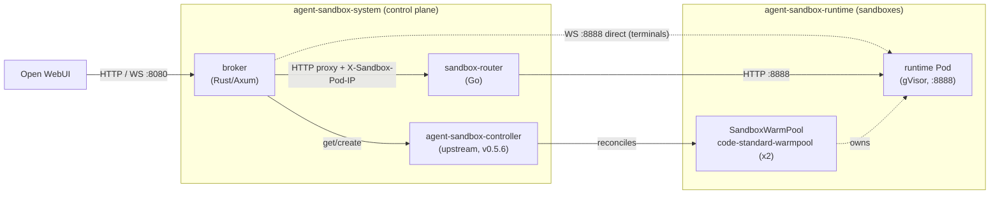

# open-websandbox

[](https://github.com/volkermauel/open-websandbox/actions/workflows/ci.yml)
[](./LICENSE)


**A Kubernetes sandbox runtime that backs Open WebUI's *Open Terminal* feature.**

Each chat gets an isolated Linux sandbox running under **gVisor (`runsc`)**. An agent
(or a human in the terminal UI) can run shell commands, edit files, and install
packages on what looks like a throwaway VM — but without a VM's blast radius. One
gVisor sandbox runs **per active chat**; a warm pool hides cold-start latency; and
default-deny networking keeps sandboxes off the rest of the cluster.

> **Project name.** This repository is **open-websandbox** (licensed
> [AGPL-3.0-only](./LICENSE)). Its container images and Helm chart still carry the
> historical names `open-websandbox-*` / chart `open-websandbox`; a global rename is
> tracked in [#3](https://github.com/volkermauel/open-websandbox/issues/3). The
> control plane rests on the upstream
> [`kubernetes-sigs/agent-sandbox`](https://github.com/kubernetes-sigs/agent-sandbox)
> project (controller + CRDs under `agents.x-k8s.io`) — those upstream references
> are kept verbatim and are **not** part of our rename.

## How it works (one paragraph)

Open WebUI calls the **broker** (Rust/Axum), which authenticates the request,
gets-or-creates the right sandbox user + session via the agent-sandbox CRDs, and
reverse-proxies the in-sandbox **runtime** (Rust/Axum on `:8888`) through the
Go **sandbox-router** (a Pod-IP cache for the fast path; falls back to cluster DNS).
The broker's idle reaper **parks** idle persistent sandboxes (Pod gone, PVC kept)
and **reaps** abandoned ones. The runtime exposes `POST /execute`, `GET|POST /files/*`,
`GET /ports`, and interactive PTY terminals over `WS /api/terminals/{id}`. See
[`docs/architecture.md`](./docs/architecture.md) for the component layers, per-chat
lifecycle, and the four isolation layers.



## Current status

**v0.1.0 — pre-release.** The platform is functionally complete and unit-tested, and
the full install path runs green in the KIND e2e suite, but it has **not** carried
real tenant traffic in production. Treat it as ready for evaluation and staging, not
as battle-proven. Outstanding work and known risks are tracked in
[GitHub issues](https://github.com/volkermauel/open-websandbox/issues) (see the `roadmap`
and `known-limitation` labels).

## Known limitations

**Single shared broker secret (no per-tenant identity).** open-websandbox authenticates
Open WebUI with one shared `BROKER_SHARED_SECRET` and trusts the `X-User-Id` /
`X-Session-Id` headers it forwards, so **any holder of that secret can impersonate any
user.** Per-tenant OIDC / short-lived identity tokens **will not be implemented in the
foreseeable future** — this is recorded as a `wontfix` decision in the issue tracker. The
intended deployment posture is **behind a trusted gateway** (e.g. Open WebUI) that performs
its own authentication and never exposes the shared secret to end users. The broker ingress
is default-deny, and the broker fails closed if the secret is unset or still the placeholder.
If you need cryptographic per-tenant identity isolation, that is currently out of scope — do
not deploy this without the trusted-gateway posture.

## Quick start

A cluster-admin can bring up the whole stack — controller + CRDs, three images, Helm
chart, warm pool, and a smoke test — in a few minutes. The copy-pasteable walk-through
lives in **[`docs/quickstart.md`](./docs/quickstart.md)**.

Since [#39](https://github.com/volkermauel/open-websandbox/pull/39), a single `helm install`
brings up the **entire** platform — the vendored, SHA256-pinned upstream
`agent-sandbox` controller + CRDs (`upstream.deploy: true` by default) **plus** the
broker, sandbox-router, SandboxTemplate, SandboxWarmPool, NetworkPolicy, and quotas.
The four `agents.x-k8s.io` / `extensions.agents.x-k8s.io` CRDs ship in `chart/crds/` and
are applied before the chart's templates, so there is no separate manual
`kubectl apply` step.

> **Pre-release — the three platform images are not published yet.** No GitHub Release
> has been cut, so `ghcr.io/volkermauel/open-websandbox-{broker,runtime,router}:v0.1.0` do
> not exist yet; an install that pulls them hits `ImagePullBackOff` until the first
> `v0.1.0` tag. Until then **build the three images locally and install from your
> checkout** (the chart defaults to `imagePullPolicy: Never`, so it uses your
> pre-loaded images — no registry pull). See [**`docs/quickstart.md`**](./docs/quickstart.md)
> §Option A, and the post-release GHCR/OCI paths.

```bash
# 1. Prereqs already in place: Kubernetes >= 1.28, gVisor RuntimeClass, RWX storage.
# 2. Namespaces (the chart does not create them):
kubectl create namespace agent-sandbox-system agent-sandbox-runtime

# 3. (Optional) Verify the integrity of the vendored upstream manifest the chart
#    renders from — the controller + CRDs are installed BY the chart itself:
sha256sum -c open-websandbox-platform/upstream/SHA256SUMS

# 4. Build + load the 3 images (broker, runtime, router), then install from the local
#    chart (default values = pre-loaded images, imagePullPolicy: Never, no GHCR pull).
#    Build/load commands: docs/deploy.md §2.
helm install open-websandbox open-websandbox-platform/chart

# 5. Wait for the control plane + warm pool:
kubectl -n agent-sandbox-system wait deploy/owui-broker deploy/sandbox-router \
  --for=condition=Available
kubectl -n agent-sandbox-runtime wait sandboxwarmpool/code-standard-warmpool \
  --for=jsonpath='{.status.readyReplicas}'=2 --timeout=180s
```

Already manage the upstream controller cluster-wide? Pass `--set upstream.deploy=false`
(and `--skip-crds` if the CRDs are already present).

Then point Open WebUI at `http://owui-broker.agent-sandbox-system.svc:8080` with the
`Authorization` header set to the broker shared secret (auto-generated; retrieve it
from `Secret/owui-broker-secret`). Full Open WebUI wiring in
[`docs/deploy.md`](./docs/deploy.md).

## Prerequisites

- **Kubernetes >= 1.28**
- **gVisor `RuntimeClass`** installed cluster-wide (see [`infra/gvisor/`](./infra/gvisor/))
- **RWX `StorageClass`** (e.g. CephFS / `ReadWriteMany`) — persistent sandboxes need
  RWX to park/resume.
- A working CNI that enforces `NetworkPolicy`, and cluster-admin rights (to apply CRDs).

For the full prerequisites checklist, image build/load steps, broker env-var reference,
and Open WebUI wiring, see [`docs/deploy.md`](./docs/deploy.md).

## Documentation

| Doc | What's in it |
|-----|--------------|
| [**Quick start**](./docs/quickstart.md) | Copy-pasteable end-to-end install + smoke test for a cluster-admin. |
| [Architecture](./docs/architecture.md) | broker ↔ router ↔ runtime ↔ controller flow (Mermaid), per-chat lifecycle (warm → claim → park/suspend → reap), ephemeral vs. persistent workspaces, four isolation layers. |
| [Deployment guide](./docs/deploy.md) | Full prerequisites + install: gVisor nodes, controller + CRDs, RWX storage, namespaces, private-registry image pull, building/loading the 3 images, broker shared-secret, Open WebUI wiring, broker env-var table, production values presets. |
| [Operations runbook](./docs/operations.md) | Warm-pool tuning, idle park/reap policy, ResourceQuota/LimitRange limits, Backup & Restore (per-user PVCs), troubleshooting, rolling the runtime image, upgrade/rollback. |
| [open-terminal compatibility](./docs/compatibility.md) | Endpoint-by-endpoint matrix against open-terminal v0.12.3 (the Open WebUI *Open Terminal* contract) + documented divergences. |
| [Security model](./docs/security.md) | The four isolation layers and threat model. |
| [Production-readiness checklist](./docs/production-readiness-checklist.md) | Table-stakes hardening before real tenants. |
| [`infra/gvisor/`](./infra/gvisor/) | Online-safe gVisor install/activate + `RuntimeClass`. |
| [`CHANGELOG.md`](./CHANGELOG.md) | Release history. |

## Contributing

See [`CONTRIBUTING.md`](./CONTRIBUTING.md). This is a young project — issues and PRs
are welcome.

## License

[AGPL-3.0-only](./LICENSE) © the open-websandbox contributors.
