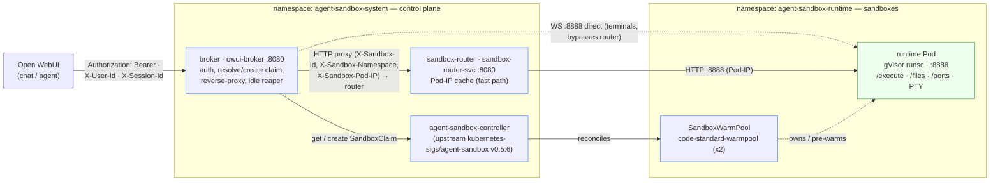
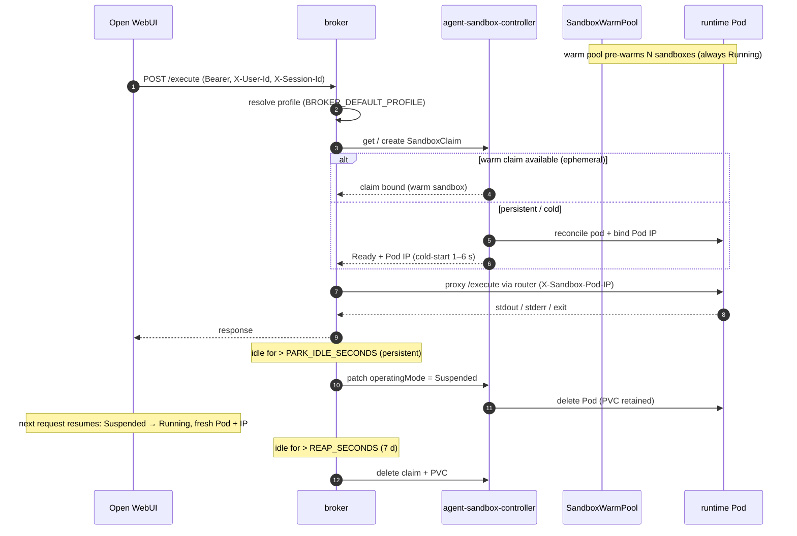
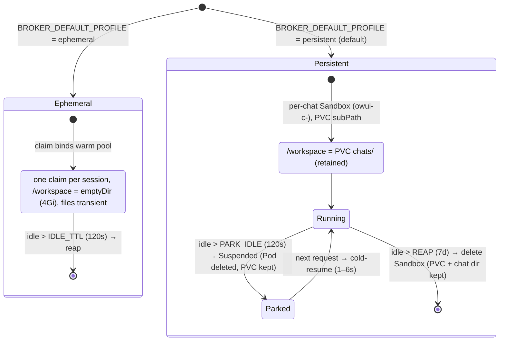

# Architecture

**open-websandbox** is a Kubernetes sandbox runtime that backs Open WebUI's "Open
Terminal" feature. Each chat gets an isolated Linux sandbox running under
**gVisor (`runsc`)**; an agent (or a human in the terminal UI) can run shell commands,
edit files, and install packages on what looks like a throwaway VM — without a VM's
blast radius.

This document describes the component topology and data flow, the per-chat sandbox
lifecycle, the two workspace modes, and the isolation layers. The decision-log
rationale lives in [`openspec/changes/archive/adopt-agent-sandbox/design.md`](../openspec/changes/archive/adopt-agent-sandbox/design.md).

## Components

| Component | Language | Where it runs | Role |
|-----------|----------|---------------|------|
| **broker** | Rust (axum/tokio) | `agent-sandbox-system` (Deploy `owui-broker`, `:8080`) | Front door. Authenticates Open WebUI (shared bearer + `X-User-Id` / `X-Session-Id`), resolves or creates the sandbox user + session via the agent-sandbox CRDs, waits for `Ready`, reads the live Pod IP, and reverse-proxies the in-sandbox runtime. Owns the idle reaper (park / reap). Endpoints: `/api/config`, `/api/status`, `/api/terminals/{id}` (WS), `/healthz`, `/readyz`, `/metrics`; everything else (`/execute`, `/files/*`, `/ports`, …) is proxied to the runtime. ([`rust/broker/`](../rust/broker/)) |
| **sandbox-router** | Go (self-built) | `agent-sandbox-system` (Deploy `sandbox-router`, Service `sandbox-router-svc:8080`) | Reverse proxy that dials the live sandbox Pod IP directly on `:8888`. Keeps a Pod-IP cache (it watches sandbox-owned pods cluster-wide) for the fast path and falls back to cluster DNS. Built from upstream `kubernetes-sigs/agent-sandbox`'s `sandbox-router/Dockerfile` at the pinned tag. ([`open-websandbox-platform/deploy/base/router/`](../open-websandbox-platform/deploy/base/router/)) |
| **runtime** | Rust (axum/tokio) | each sandbox pod in `agent-sandbox-runtime` (`:8888`) | Runs **inside** each sandbox. `POST /execute`, a rich `/files/*` API (read/write/list/glob/grep/cwd/mkdir/move/replace/delete/upload/archive), `GET /ports`, and interactive PTY terminals over `POST /api/terminals` + `WS /api/terminals/{id}`. ([`rust/runtime/`](../rust/runtime/)) |
| **agent-sandbox controller** | Go (upstream) | `agent-sandbox-system` (Deploy `agent-sandbox-controller`) | Upstream [`kubernetes-sigs/agent-sandbox`](https://github.com/kubernetes-sigs/agent-sandbox) controller, pinned **v0.5.6** (image `registry.k8s.io/agent-sandbox/agent-sandbox-controller:v0.5.6`). Reconciles the `agents.x-k8s.io` / `extensions.agents.x-k8s.io` CRDs: `SandboxTemplate`, `SandboxWarmPool`, `SandboxClaim`, `Sandbox`. Vendored + SHA256-recorded in [`open-websandbox-platform/upstream/`](../open-websandbox-platform/upstream/). |

We vendor the upstream manifest (SHA256-recorded) rather than `kubectl apply` a
remote URL, so deploys are reproducible and auditable. See
[`open-websandbox-platform/upstream/SHA256SUMS`](../open-websandbox-platform/upstream/SHA256SUMS).

## Topology and data flow

The four numbered steps below trace one request:

1. **Auth + headers.** Open WebUI calls the broker with a shared bearer
   (`Authorization`) plus `X-User-Id` and `X-Session-Id` per session. The broker checks
   the bearer in constant time (`hmac.compare_digest`).
2. **Resolve sandbox.** The broker get-or-creates the right `SandboxClaim` for the
   user/session/profile (see [Lifecycle](#lifecycle) and
   [Workspace modes](#workspace-modes-ephemeral-vs-persistent)), waits for the sandbox
   `Ready` condition, and reads the live Pod IP from the resource status.
3. **Proxy HTTP** (`/execute`, `/files/*`, `/ports`, …). The broker forwards to the
   `sandbox-router` Service, injecting `X-Sandbox-Id`, `X-Sandbox-Namespace`, and
   `X-Sandbox-Pod-IP`. The router uses Pod-IP (priority-1) resolution and dials the pod
   directly on `:8888`.
4. **Terminal WebSocket** (`/api/terminals/{session_id}`). The broker resolves the Pod IP
   itself and opens `ws://<pod-ip>:8888/...` **directly** — the runtime-namespace
   `NetworkPolicy` permits ingress from `agent-sandbox-system` on `8888`, and bypassing
   the router avoids a WebSocket-upgrade timeout. The first WS frame is
   `{"type":"auth","token":<shared-secret>}`.

> The runtime never trusts client-supplied routing identifiers. The broker derives the
> sandbox name deterministically from `X-User-Id` / `X-Session-Id` server-side.

## Lifecycle

The reaper is a stateless, idempotent loop inside the broker (only the lease-holding
replica reaps in HA mode). It labels the resources it owns
(`app.kubernetes.io/managed-by=owui-broker`) and stamps a `broker-last-used`
annotation, so restarting the broker re-derives ownership from labelled claims and
sandboxes and never orphans a session.

| Tunable (env) | Default | Effect |
|----------------|---------|--------|
| `BROKER_CLAIM_TIMEOUT_SECONDS` | `60` | How long the broker waits for a fresh claim to bind before returning a 504 to Open WebUI. |
| `BROKER_IDLE_TTL_SECONDS` | `120` | **Ephemeral** idle reap — claim returns to the warm pool. |
| `BROKER_PARK_IDLE_SECONDS` | `120` | **Persistent** idle park — `operatingMode` patched to `Suspended`: Pod deleted, node freed, **PVC retained**. Cold-resume on next request is ~1–6 s. |
| `BROKER_REAP_SECONDS` | `604800` (7 d) | **Persistent** reap — claim deleted, PVC freed. |

> Density model: **no permanent pod per user.** Pods exist only while a chat is active
> (ephemeral) or recently active (persistent, until parked). The warm pool hides
> cold-start; parking frees nodes. This is the core trade-off vs. a
> one-daemon-per-host design.

## Workspace modes: ephemeral vs. persistent

`/workspace` is the agent's working directory. The mode is chosen **at deploy time** by
`BROKER_DEFAULT_PROFILE` (the chart default is **`persistent`** — Open WebUI cannot send
custom request headers, so the profile can't vary per call); an explicit `X-Persistence`
header/query still overrides it for admin/testing. See the broker env-var reference in
[`deploy.md`](deploy.md#broker-environment-variable-reference).

### Ephemeral

- `/workspace` is an **emptyDir** (`sizeLimit: 4Gi`) defined in the `code-standard-v1`
  `SandboxTemplate`.
- One claim per **session**: `owui-<sha256(user|session)[:12]>`.
- Files are destroyed when the claim is reaped (idle / session end); the warm pool
  builds a clean replacement.

### Persistent (chart default)

`/workspace` is backed by a **hot tier**, deploy-selectable via
`broker.persistentMode` (#140). **PVC granularity is the user (quota/reclaim),
subPath granularity is the chat (isolation)** — every chat mounts only its own
directory, so a chat's terminal can only ever see or delete its own files:

| `broker.persistentMode` | Sandbox (per chat) | PVC | `/workspace` subPath |
|--------------------------|--------------------|-----|------------------------|
| **`per-user-pvc`** (default) | `owui-c-<sha256(user\|session)[:12]>` | one per user: `workspace-p-<sha256(user)[:12]>` (broker-created, RWX, default `10Gi`) | `chats/<sha256(user/session)[:12]>` |
| **`shared-subpath`** | `owui-c-<sha256(user\|session)[:12]>` | ONE shared `workspace-shared` (chart-rendered, RWX, `cephfs`, `50Gi`) | `users/<sha256(user)[:12]>/chats/<sha256(user/session)[:12]>` |
| **`empty-dir`** (#52, #142) | `owui-c-<sha256(user\|session)[:12]>` | none (emptyDir hot tier; needs `broker.s3.enabled`) | — (S3 cold tier is the only durability) |

The broker repoints the cloned pod template's `workspace` volume at the PVC and
stamps the per-chat `subPath` on its mount (kubelet creates a missing subPath
directory; the pod's `fsGroup: 1000` makes it writable). Reaping a sandbox
deletes the Sandbox object but **never the PVC or chat directories** — a
returning chat transparently re-resolves over its data.

#### Cold tier composes with every hot tier (#142)

`broker.s3.enabled` is an independent **cold tier** — it never changes the hot
tier anymore:

| hot tier \ cold tier | S3 off | S3 on |
|---|---|---|
| `per-user-pvc` / `shared-subpath` | park/resume over the PVC (hybrid tiering off) | **hybrid tiering**: park serves the PVC; reap offloads to S3, purges the chat dir from the PVC, and the next resolve restores from S3 |
| `empty-dir` | invalid (fails closed at boot) | tier-only: reap offloads to S3, restore on resolve (#52 behavior) |

Hybrid reap briefly resumes a suspended sandbox so a pod exists to snapshot,
offloads, then clears the chat dir (`find /workspace -mindepth 1 -delete`) to
free the hot tier. Restore only happens into an **empty** workspace — a stale
cold object can never clobber newer PVC data (the runtime's reserved
`.open-websandbox/` dir does not count as data; it is recreated by the SIGTERM
scrollback flush after a purge).

Either way the runtime validates every path before touching it (`safe_path` in
[`rust/runtime/`](../rust/runtime/)) so a session can only
read/write its own subtree.

## Isolation layers

Every layer assumes the one below it was breached. Breaching one does **not** grant the
next:

1. **gVisor userspace kernel.** `runtimeClassName: gvisor` (`runsc`, systrap profile).
   Syscalls are intercepted and filtered in userspace; the guest never touches the host
   kernel directly. Node setup: [`infra/gvisor/`](../infra/gvisor/).
2. **Non-root, least privilege.** `runAsUser`/`runAsGroup`/`fsGroup: 1000`,
   `runAsNonRoot: true`, **all Linux capabilities dropped**, `seccomp: RuntimeDefault`.
   (See `securityContext` in
   [`sandboxtemplate-code-standard.yaml`](../open-websandbox-platform/deploy/base/sandboxtemplate-code-standard.yaml).)
3. **No Kubernetes identity.** `automountServiceAccountToken: false`; the
   `KUBERNETES_SERVICE_*` env vars are explicitly unset, so the in-sandbox service CIDR
   isn't even discoverable. Users never hold a kubeconfig/token; only the broker has a
   narrowly scoped `Role` ([`broker.yaml`](../open-websandbox-platform/deploy/base/broker.yaml))
   to create claims.
4. **Default-deny network.** The runtime-namespace
   [`NetworkPolicy`](../open-websandbox-platform/deploy/base/networkpolicy-runtime.yaml)
   allows only:
   - **ingress** from `agent-sandbox-system` on TCP/8888 (router + broker),
   - **egress** to public DNS resolvers (UDP/TCP 53 → `8.8.8.8` / `1.1.1.1`; the
     template also sets `dnsPolicy: None` so no cluster DNS IP or namespace search
     domain leaks), **HTTPS+HTTP (443/80)**, and explicitly **blocks RFC1918 +
     link-local CIDRs** (anti-lateral movement). So `pip`/`npm`/`git` over HTTPS work,
     but reaching the cluster API or a neighbour pod silently fails.

On top of these, each sandbox is per-command bounded: `DEFAULT_TIMEOUT` (120 s) and
`MAX_TIMEOUT` (600 s) cap command wall-clock; output is truncated at `MAX_OUTPUT_BYTES`
(1 MiB); `MAX_PROCS` / `RLIMIT_NPROC` caps processes at 256; and `/tmp` is a RAM-backed
`emptyDir` (`medium: Memory`, 2 Gi) that returns `ENOSPC` rather than filling the node
disk.

> **Control-plane ingress hardening (#98).** The broker — the front door that
> validates `BROKER_SHARED_SECRET` — ships its own default-deny
> [`NetworkPolicy`](../open-websandbox-platform/deploy/base/networkpolicy-broker.yaml)
> (ingress only) so only the Open Web UI namespace (+ Prometheus, when enabled)
> can reach it on `:8080`. This closes the in-cluster bearer-oracle surface where
> any pod could otherwise hammer the shared-secret comparison. It is gated by
> `broker.networkPolicy.enabled` (default `true`; off in KIND e2e, which reaches the
> broker via `kubectl port-forward`), and its source namespace(s) are configurable
> via `broker.networkPolicy.ingress.fromNamespaces`.

## Non-goals

Explicitly out of scope: desktops/VMs, GPU, uncontrolled in-sandbox APIs, and
port-forwarding arbitrary host ports. Notebooks/desktops and port-proxying are handled
elsewhere in Open WebUI, not by this runtime.
